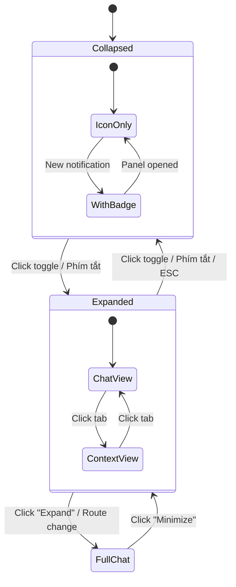

# 🎨 UX Research & Design – AI Tutor Chat Panel

## 1. Phân tích UX Mockup

Dựa trên mockup được cung cấp, giao diện chat panel bao gồm các thành phần:

### 1.1 Layout tổng thể

```
┌──────┬───────────────────────────────┬──────────────────────┐
│ Nav  │       Chat Area (Center)      │  Context Panel (R)   │
│ Bar  │                               │                      │
│      │  ┌─────────────────────────┐  │  ┌────────────────┐  │
│  +   │  │ "Personal Tutoring &    │  │  │ Learnify Tutor │  │
│  🔍  │  │  Goal Planning"         │  │  │ AI v2.6    ☐   │  │
│  📎  │  │                         │  │  ├────────────────┤  │
│  ✨  │  │  User bubble ──────►   │  │  │ Calendar &     │  │
│      │  │  AI response ◄──────   │  │  │ Planning       │  │
│      │  │                         │  │  │ Learning       │  │
│      │  │  [Roadmap Card]         │  │  │ Resources      │  │
│      │  │  [Target Dashboard]     │  │  │ Recommended    │  │
│      │  │                         │  │  │ Courses        │  │
│  ⚙️  │  │                         │  │  ├────────────────┤  │
│      │  └─────────────────────────┘  │  │ Chat History   │  │
│      │                               │  │ Today / Yest.  │  │
│      │  ┌─────────────────────────┐  │  │ Previous 7D    │  │
│      │  │ Context | Members |     │  │  └────────────────┘  │
│      │  │ Resources | Course      │  │                      │
│      │  ├─────────────────────────┤  │  ┌────────────────┐  │
│      │  │ + Type your message...  │  │  │ Quick Action   │  │
│      │  │           🎤  😊  ➤    │  │  │ Bubble         │  │
│      │  └─────────────────────────┘  │  │ 🤖 Mascot      │  │
│      │                               │  └────────────────┘  │
│  L   │                               │                      │
└──────┴───────────────────────────────┴──────────────────────┘
```

### 1.2 Các thành phần chính từ Mockup

| Thành phần | Vị trí | Mô tả |
|---|---|---|
| **Left Navigation** | Cột trái | Menu icon: New chat, Search, Attach, Tools, Settings |
| **Chat Area** | Giữa | Vùng hội thoại chính – chat bubbles + rich cards |
| **Context Tabs** | Dưới chat | Tabs: Context, Context Members, Learning Resource, Course |
| **Input Bar** | Dưới cùng | Text input + Attach + Voice + Emoji + Send |
| **Right Panel** | Cột phải | AI version, Calendar, Resources, Recommended, Chat history |
| **Quick Action** | Góc phải dưới | Bubble thông báo nhanh + Mascot |

## 2. UX Patterns từ ngành (Industry Research)

### 2.1 Copilot-Style Side Panel

**Tham khảo**: VS Code Copilot, GitHub Copilot, Microsoft 365 Copilot

| Pattern | Best Practice | Áp dụng |
|---|---|---|
| **Toggle Open/Close** | Nút rõ ràng, smooth animation (300ms) | Toggle button trên toolbar + phím tắt |
| **Resize** | Cho phép drag resize, min 280px – max 50% viewport | Drag handle ở cạnh trái panel |
| **Collapsed State** | Icon bar 48-64px + tooltip | Hiện icon chat + badge notification |
| **Context Awareness** | Panel hiểu content trang đang xem | Detect khóa học/quiz/video đang mở |
| **Non-Blocking** | Không che main content, overlay trên mobile | Responsive: side panel → bottom sheet |

### 2.2 Chat Interface Patterns

**Tham khảo**: ChatGPT, Khanmigo, Intercom

| Pattern | Best Practice |
|---|---|
| **Bubble Layout** | User bên phải (xanh), AI bên trái (trắng/xám) |
| **Rich Messages** | Hỗ trợ markdown, cards, charts, inline buttons |
| **Typing Indicator** | Animated dots khi AI đang xử lý |
| **Streaming** | Stream response từng token (real-time feel) |
| **Quick Replies** | Suggestion chips cho câu hỏi phổ biến |
| **Feedback** | Thumbs up/down trên mỗi response |
| **Retry** | Nút regenerate nếu response không tốt |

### 2.3 Proactive Engagement

**Tham khảo**: Khanmigo, Duolingo Max

| Pattern | Mô tả |
|---|---|
| **Welcome Message** | Chào + tóm tắt tiến độ khi mở panel |
| **Nudge Notifications** | Notification bubble: "Đã đến giờ học!" |
| **Progress Check-ins** | Tự động hỏi sau khi hoàn thành quiz/bài học |
| **Celebration** | Hiệu ứng khi đạt milestone |
| **Suggestion** | Gợi ý hành động tiếp theo dựa trên context |

## 3. Thiết kế UX chi tiết

### 3.1 States của Panel



### 3.2 Panel States rõ ràng

| State | Width | Hiển thị | Trigger |
|---|---|---|---|
| **Collapsed** | 48px | Chat icon + notification badge | Mặc định / ESC / Toggle |
| **Expanded** | 360-420px | Full chat interface | Click icon / phím tắt Ctrl+L |
| **Full Page** | 100% | Giao diện chat chuyên dụng (như mockup) | Route `/chat` |

### 3.3 Responsive Design

| Breakpoint | Desktop (≥1200px) | Tablet (768-1199px) | Mobile (<768px) |
|---|---|---|---|
| **Default** | Side panel phải | Side panel phải | Hidden |
| **Expanded** | Overlay trên main | Overlay | Bottom sheet full |
| **Interaction** | Click + drag resize | Click toggle | Swipe up/down |

### 3.4 Context Tabs (Từ Mockup)

| Tab | Chức năng | Data source |
|---|---|---|
| **Context** | Hiện context hiện tại: khóa học, tiến độ, mục tiêu | `learning_profile`, `roadmap` |
| **Context Members** | Hiện learning group hoặc peer learners | Organization members |
| **Learning Resource** | Tài liệu bổ trợ AI đề xuất | Course materials + AI suggestion |
| **Course** | Khóa học liên quan đang học | `assigned_courses` |

### 3.5 Rich Message Types

```
┌─ Text Message ──────────────────────────────┐
│ Tin nhắn text thường, hỗ trợ markdown       │
└─────────────────────────────────────────────┘

┌─ Roadmap Card ──────────────────────────────┐
│ ┌───────────────┬─────────────────────┐     │
│ │ IELTS 6.5     │  Target Dashboard   │     │
│ │ Roadmap       │  ┌─► Course A ───►│     │
│ │               │  └─► Course B     │     │
│ │ Progress: 35% │     └─► Milestone │     │
│ └───────────────┴─────────────────────┘     │
│                               [View Detail] │
└─────────────────────────────────────────────┘

┌─ Progress Card ─────────────────────────────┐
│ 📊 Milestone 2: Listening & Reading         │
│ ████████░░ 45%    Status: On Track          │
│ Next: Hoàn thành Quiz chương 3              │
│                        [Go to Quiz] [Skip]  │
└─────────────────────────────────────────────┘

┌─ Quick Action Chips ────────────────────────┐
│ [📋 Xem lộ trình] [📊 Tiến độ] [📚 Gợi ý] │
└─────────────────────────────────────────────┘
```

## 4. Interaction Flows

### 4.1 Flow: Lần đầu mở panel

```
1. User click chat icon
2. Panel slide-in (300ms ease-out)
3. Welcome message: "Chào [Name]! Tôi là Learnify Tutor AI."
4. Proactive survey starts:
   "Mục tiêu học tập của bạn là gì?"
   → Quick reply chips: [IELTS 6.5] [IELTS 7.0] [Tự nhập]
5. Thu thập: target, deadline, current_level, commitment
6. AI tạo roadmap → hiển thị Roadmap Card
```

### 4.2 Flow: Mở panel khi đang học

```
1. User click chat icon (đang ở trang Course "Reading Strategies")
2. Panel mở + detect context: course_id = "course_ielts_reading_02"
3. Welcome message contextualized:
   "Bạn đang học Reading Strategies – tiến độ 45%.
    Bạn yếu phần Matching Headings. Cần tôi giúp gì?"
4. Quick chips: [Giải thích Matching Headings] [Quiz thử] [Xem lộ trình]
```

### 4.3 Flow: Proactive Notification

```
1. ai_agent_state.suggested_next_action triggers notification
2. Bubble xuất hiện ở mascot: "Hoàn thành quiz chương 3 để chốt Milestone 2!"
3. User click bubble → Panel mở → Message displayed
4. Quick action: [Go to Quiz] [Remind Later] [Skip]
```
