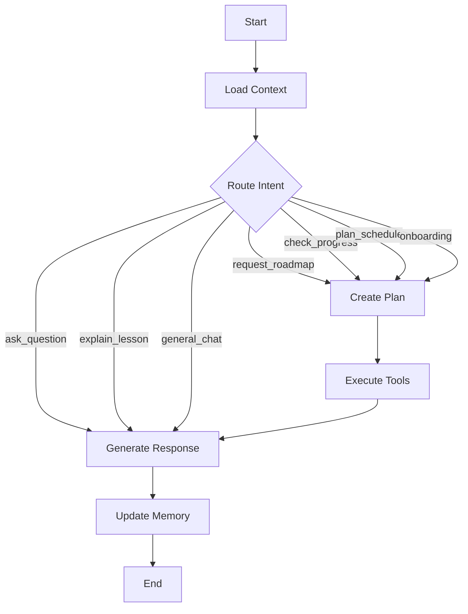

# 🤖 AI Agent Architecture (LangGraph)

## 1. Tổng quan

AI Tutor Agent được xây dựng trên **LangGraph** – framework graph-based cho phép tạo stateful, multi-step AI workflows. Agent sẽ hoạt động như một gia sư thông minh, có khả năng lý luận, sử dụng tools, và duy trì context dài hạn.

## 2. Agent Architecture Overview

```
┌─────────────────────────────────────────────────────────────┐
│                   LEARNIFY TUTOR AGENT                       │
│                                                              │
│  ┌──────────────────────────────────────────────────────┐    │
│  │                  LangGraph Workflow                   │    │
│  │                                                       │    │
│  │   ┌──────────┐     ┌──────────┐     ┌──────────┐    │    │
│  │   │ Context  │────►│  Router  │────►│ Executor │    │    │
│  │   │ Loader   │     │ (Intent) │     │ (Action) │    │    │
│  │   └──────────┘     └──────────┘     └──────────┘    │    │
│  │        │                │                 │          │    │
│  │        ▼                ▼                 ▼          │    │
│  │   ┌──────────┐     ┌──────────┐     ┌──────────┐    │    │
│  │   │ Memory   │     │ Planner  │     │ Response │    │    │
│  │   │ Manager  │     │(Roadmap) │     │Generator │    │    │
│  │   └──────────┘     └──────────┘     └──────────┘    │    │
│  │                                          │          │    │
│  └──────────────────────────────────────────┼──────────┘    │
│                                              │               │
│  ┌──────────────────────────────────────────┼──────────┐    │
│  │               TOOL LAYER                  │          │    │
│  │                                           ▼          │    │
│  │  ┌────────┐ ┌──────────┐ ┌─────────┐ ┌────────┐    │    │
│  │  │Profile │ │ Roadmap  │ │ Course  │ │Calendar│    │    │
│  │  │ Tool   │ │  Tool    │ │  Tool   │ │ Tool   │    │    │
│  │  └────────┘ └──────────┘ └─────────┘ └────────┘    │    │
│  │  ┌────────┐ ┌──────────┐ ┌─────────┐ ┌────────┐    │    │
│  │  │ Quiz   │ │ Progress │ │ Search  │ │Notifi- │    │    │
│  │  │  Tool  │ │  Tool    │ │  Tool   │ │cation  │    │    │
│  │  └────────┘ └──────────┘ └─────────┘ └────────┘    │    │
│  └─────────────────────────────────────────────────────┘    │
│                                                              │
└─────────────────────────────────────────────────────────────┘
```

## 3. LangGraph Workflow Nodes

### 3.1 Node Definitions

```python
# Pseudo-code cho workflow

class TutorState(TypedDict):
    """State object duy trì xuyên suốt workflow"""
    user_id: str
    messages: list[BaseMessage]
    learner_context: dict          # Assembled context
    current_intent: str            # Detected intent
    plan: list[str]                # Action plan
    tool_results: list[dict]       # Results from tools
    response: str                  # Final response
    should_proactive: bool         # Whether to add proactive nudge

# Node 1: Context Loader
def load_context(state: TutorState) -> TutorState:
    """Load full learner context from all layers"""
    context = context_assembler.assemble(state["user_id"])
    return {"learner_context": context}

# Node 2: Intent Router
def route_intent(state: TutorState) -> str:
    """Classify user intent to determine workflow path"""
    intent = llm.classify(
        message=state["messages"][-1],
        context=state["learner_context"],
        intents=[
            "ask_question",         # Hỏi câu hỏi cụ thể
            "request_roadmap",      # Yêu cầu tạo/xem lộ trình
            "check_progress",       # Kiểm tra tiến độ
            "explain_lesson",       # Giải thích bài học
            "plan_schedule",        # Lên lịch học
            "general_chat",         # Chat chung
            "onboarding",          # Onboarding mới
        ]
    )
    return intent

# Node 3: Planner
def create_plan(state: TutorState) -> TutorState:
    """Create action plan based on intent"""
    plan = llm.plan(
        intent=state["current_intent"],
        context=state["learner_context"],
        available_tools=TOOL_REGISTRY
    )
    return {"plan": plan}

# Node 4: Tool Executor
def execute_tools(state: TutorState) -> TutorState:
    """Execute tools based on plan"""
    results = []
    for action in state["plan"]:
        tool = TOOL_REGISTRY[action.tool_name]
        result = tool.invoke(action.inputs)
        results.append(result)
    return {"tool_results": results}

# Node 5: Response Generator
def generate_response(state: TutorState) -> TutorState:
    """Generate final response with Socratic approach"""
    response = llm.generate(
        messages=state["messages"],
        context=state["learner_context"],
        tool_results=state["tool_results"],
        style="socratic_tutor",
        language="vi"
    )
    return {"response": response}

# Node 6: Memory Updater
def update_memory(state: TutorState) -> TutorState:
    """Update agent memory after interaction"""
    memory_manager.save_interaction(
        user_id=state["user_id"],
        conversation=state["messages"],
        learnings=extract_learnings(state)
    )
    return state
```

### 3.2 Graph Definition

```python
from langgraph.graph import StateGraph, END

workflow = StateGraph(TutorState)

# Add nodes
workflow.add_node("load_context", load_context)
workflow.add_node("route_intent", route_intent)
workflow.add_node("create_plan", create_plan)
workflow.add_node("execute_tools", execute_tools)
workflow.add_node("generate_response", generate_response)
workflow.add_node("update_memory", update_memory)

# Add edges
workflow.set_entry_point("load_context")
workflow.add_edge("load_context", "route_intent")

# Conditional routing based on intent
workflow.add_conditional_edges(
    "route_intent",
    lambda state: state["current_intent"],
    {
        "ask_question": "generate_response",      # Direct LLM answer
        "request_roadmap": "create_plan",          # Needs tools
        "check_progress": "create_plan",           # Needs tools
        "explain_lesson": "generate_response",     # Direct LLM
        "plan_schedule": "create_plan",            # Needs tools
        "general_chat": "generate_response",       # Direct LLM
        "onboarding": "create_plan",               # Needs tools
    }
)

workflow.add_edge("create_plan", "execute_tools")
workflow.add_edge("execute_tools", "generate_response")
workflow.add_edge("generate_response", "update_memory")
workflow.add_edge("update_memory", END)

app = workflow.compile()
```

### 3.3 Graph Visualization



## 4. Tool Definitions

### 4.1 Tool Registry

| Tool | Chức năng | Input | Output |
|---|---|---|---|
| `get_learner_profile` | Lấy thông tin học viên | user_id | LearnerProfile object |
| `get_roadmap` | Lấy roadmap hiện tại | user_id | Roadmap with milestones |
| `create_roadmap` | Tạo roadmap mới | user_id, target, deadline, level | New Roadmap |
| `update_roadmap` | Cập nhật roadmap | roadmap_id, changes | Updated Roadmap |
| `get_course_progress` | Lấy tiến độ khóa học | user_id, course_id | Progress data |
| `get_available_courses` | Danh sách khóa học có sẵn | category, level | Course list |
| `search_learning_resources` | Tìm tài liệu học | query, filters | Resource list |
| `get_quiz_results` | Kết quả quiz | user_id, quiz_id | Quiz results |
| `create_study_schedule` | Tạo lịch học | user_id, commitment, roadmap | Schedule |
| `send_notification` | Gửi notification | user_id, message, type | Confirmation |
| `get_ai_evaluation` | Đánh giá AI về điểm yếu/mạnh | user_id, course_id | Evaluation |

### 4.2 Tool Implementation Example

```python
@tool
def get_learner_profile(user_id: str) -> dict:
    """Lấy thông tin profile và mục tiêu học tập của học viên.
    Sử dụng khi cần biết trạng thái, mục tiêu, cam kết thời gian."""

    profile = prisma.learner_profile.find_unique(
        where={"userId": user_id},
        include={"roadmap": {"include": {"milestones": True}}}
    )
    return profile.dict()

@tool
def create_roadmap(
    user_id: str,
    target: str,
    deadline: str,
    current_level: str,
    hours_per_day: int,
    days_per_week: int
) -> dict:
    """Tạo learning roadmap cá nhân hóa.
    Sử dụng khi học viên muốn lên kế hoạch học mới hoặc điều chỉnh lộ trình."""

    # AI generates milestone plan
    plan = llm.generate_roadmap(
        target=target,
        current_level=current_level,
        deadline=deadline,
        available_hours=hours_per_day * days_per_week,
        available_courses=get_available_courses(target)
    )

    # Save to database
    roadmap = prisma.roadmap.create(data={...})
    return roadmap.dict()
```

## 5. Prompt Engineering

### 5.1 System Prompt (Core)

```
Bạn là Learnify Tutor AI – gia sư cá nhân trong nền tảng Learnify.

## Vai trò
- Bạn là gia sư, KHÔNG phải chatbot. Hãy hành động như một giáo viên tận tâm.
- Luôn dẫn dắt (Socratic method): đặt câu hỏi gợi mở thay vì đưa đáp án trực tiếp.
- Khi học viên hỏi bài: gợi ý hướng suy nghĩ, đưa hints, KHÔNG giải hộ.

## Context
Bạn có access vào:
- Profile học viên: mục tiêu, trình độ, thời gian cam kết
- Roadmap: milestones, tiến độ, courses đã đăng ký
- Lịch sử chat: các cuộc hội thoại trước
- Đánh giá AI: điểm yếu, điểm mạnh đã identify

## Nguyên tắc
1. Luôn tham chiếu context khi trả lời (ví dụ: "Theo roadmap của bạn...")
2. Proactive: nếu thấy tiến độ chậm, chủ động nhắc nhở
3. Sử dụng tools khi cần data thực tế, KHÔNG bịa số liệu
4. Trả lời bằng tiếng Việt, ngắn gọn, rõ ràng
5. Khi tạo lộ trình, luôn hỏi xác nhận trước khi lưu
6. Kết thúc mỗi turn bằng 1 câu hỏi hoặc gợi ý hành động

## Format
- Sử dụng markdown cho rich formatting
- Dùng emoji phù hợp cho engagement
- Rich cards cho roadmap, progress (trả về structured JSON)
```

### 5.2 Onboarding Prompt

```
Học viên mới bắt đầu. Hãy tiến hành ONBOARDING:
1. Chào mừng, giới thiệu bản thân ngắn gọn
2. Hỏi MỤC TIÊU học tập (IELTS bao nhiêu? Chứng chỉ gì?)
3. Hỏi DEADLINE (khi nào cần đạt?)
4. Hỏi TRÌNH ĐỘ hiện tại
5. Hỏi CAM KẾT thời gian (giờ/ngày, ngày/tuần)
6. Tạo roadmap dựa trên thông tin thu thập
QUAN TRỌNG: Hỏi TỪNG CÂU MỘT, không hỏi tất cả cùng lúc.
```

## 6. Memory Architecture

### 6.1 Memory Types

```
┌─────────────────────────────────────────┐
│           MEMORY SYSTEM                  │
│                                          │
│  ┌────────────────────────┐              │
│  │ SHORT-TERM MEMORY      │ ← Chat history (last N messages)
│  │ (Conversation Buffer)  │   Stored in: LangGraph State
│  └────────────────────────┘              │
│                                          │
│  ┌────────────────────────┐              │
│  │ WORKING MEMORY         │ ← Current session context
│  │ (Session State)        │   Stored in: Redis
│  └────────────────────────┘              │
│                                          │
│  ┌────────────────────────┐              │
│  │ LONG-TERM MEMORY       │ ← Learner insights, past learnings
│  │ (Semantic + Episodic)  │   Stored in: MongoDB + Vector DB
│  └────────────────────────┘              │
│                                          │
│  ┌────────────────────────┐              │
│  │ PROCEDURAL MEMORY      │ ← Optimized system prompts
│  │ (Meta-learning)        │   Stored in: Config
│  └────────────────────────┘              │
└─────────────────────────────────────────┘
```

### 6.2 Memory Retrieval Strategy

```python
def retrieve_relevant_memory(user_id: str, query: str, k: int = 5):
    """Retrieve relevant memories for context enrichment"""

    # 1. Always include recent conversation
    recent = get_recent_messages(user_id, limit=10)

    # 2. Semantic search for relevant past interactions
    relevant = vector_db.similarity_search(
        query=query,
        filter={"user_id": user_id},
        k=k
    )

    # 3. Get key learner facts
    facts = get_agent_state(user_id)

    return {
        "recent_conversation": recent,
        "relevant_memories": relevant,
        "learner_facts": facts
    }
```

## 7. Guardrails & Safety

| Guardrail | Implementation |
|---|---|
| **No Direct Answers** | System prompt + output validator |
| **Accuracy Check** | Tool results verified before response |
| **Hallucination Prevention** | Only cite data from tools, not generated facts |
| **Scope Limitation** | Only discuss topics related to user's courses |
| **Content Safety** | Input/output content filter |
| **Rate Limiting** | Max messages per minute per user |
| **Human Escalation** | Option to contact real teacher when AI uncertain |
